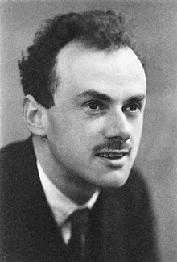

<table class="infobox biography vcard">
<tbody>
<tr>
<th colspan="2">

Paul Dirac

 

<a class="mw-redirect" title="Member of the Order of Merit" href="https://en.wikipedia.org/wiki/Member_of_the_Order_of_Merit">OM</a>&nbsp;<a title="Fellow of the Royal Society" href="https://en.wikipedia.org/wiki/Fellow_of_the_Royal_Society">FRS</a>

</th>
</tr>
<tr>
<td colspan="2">

Dirac, photographed in 1933

</td>
</tr>
<tr>
<th scope="row">Born</th>
<td>

Paul Adrien Maurice Dirac

 8 August 1902 

<a title="Bristol" href="https://en.wikipedia.org/wiki/Bristol">Bristol</a>, England

</td>
</tr>
<tr>
<th scope="row">Died</th>
<td>20 October 1984&nbsp;(aged&nbsp;82) 

<a title="Tallahassee, Florida" href="https://en.wikipedia.org/wiki/Tallahassee,_Florida">Tallahassee, Florida</a>, U.S.

</td>
</tr>
<tr>
<th scope="row">Nationality</th>
<td class="category">Swiss&nbsp;(1902&ndash;19)[<em><a title="Wikipedia:Accuracy dispute" href="https://en.wikipedia.org/wiki/Wikipedia:Accuracy_dispute#Disputed_statement">dubious</a>&nbsp;&ndash;&nbsp;<a title="Talk:Paul Dirac" href="https://en.wikipedia.org/wiki/Talk:Paul_Dirac#Nationality">discuss</a></em>] British&nbsp;(1919&ndash;84)</td>
</tr>
<tr>
<th scope="row">Alma&nbsp;mater</th>
<td>

<ul>
<li><a title="University of Bristol" href="https://en.wikipedia.org/wiki/University_of_Bristol">University of Bristol</a></li>
<li><a title="University of Cambridge" href="https://en.wikipedia.org/wiki/University_of_Cambridge">University of Cambridge</a></li>
</ul>

</td>
</tr>
<tr>
<th scope="row">Known&nbsp;for</th>
<td>

 

&nbsp;

<ul class="mw-collapsible-content">
<li>

<ul>
<li><a title="Dirac adjoint" href="https://en.wikipedia.org/wiki/Dirac_adjoint">Dirac adjoint</a></li>
<li><a title="Dirac algebra" href="https://en.wikipedia.org/wiki/Dirac_algebra">Dirac algebra</a></li>
<li><a title="Dirac bracket" href="https://en.wikipedia.org/wiki/Dirac_bracket">Dirac bracket</a></li>
<li><a title="Dirac comb" href="https://en.wikipedia.org/wiki/Dirac_comb">Dirac comb</a></li>
<li><a title="Breit equation" href="https://en.wikipedia.org/wiki/Breit_equation">Dirac&ndash;Coulomb&ndash;Breit Equation</a></li>
<li><a title="Planck constant" href="https://en.wikipedia.org/wiki/Planck_constant">Dirac constant</a></li>
<li><a title="Dirac delta function" href="https://en.wikipedia.org/wiki/Dirac_delta_function">Dirac delta function</a></li>
<li><a title="Dirac equation" href="https://en.wikipedia.org/wiki/Dirac_equation">Dirac equation</a></li>
<li><a title="Dirac fermion" href="https://en.wikipedia.org/wiki/Dirac_fermion">Dirac fermion</a></li>
<li><a title="Fermionic field" href="https://en.wikipedia.org/wiki/Fermionic_field">Dirac field</a></li>
<li><a class="mw-redirect" title="Dirac gauge" href="https://en.wikipedia.org/wiki/Dirac_gauge">Dirac gauge</a></li>
<li><a title="Dirac hole theory" href="https://en.wikipedia.org/wiki/Dirac_hole_theory">Dirac hole theory</a></li>
<li><a title="Dirac large numbers hypothesis" href="https://en.wikipedia.org/wiki/Dirac_large_numbers_hypothesis">Dirac large numbers hypothesis</a></li>
<li><a title="Gamma matrices" href="https://en.wikipedia.org/wiki/Gamma_matrices">Dirac matrices</a></li>
<li><a title="Dirac measure" href="https://en.wikipedia.org/wiki/Dirac_measure">Dirac measure</a></li>
<li><a title="Dirac membrane" href="https://en.wikipedia.org/wiki/Dirac_membrane">Dirac membrane</a></li>
<li><a class="mw-redirect" title="Dirac monopole" href="https://en.wikipedia.org/wiki/Dirac_monopole">Dirac monopole</a></li>
<li><a title="Bra&ndash;ket notation" href="https://en.wikipedia.org/wiki/Bra%E2%80%93ket_notation">Dirac notation</a></li>
<li><a title="Dirac operator" href="https://en.wikipedia.org/wiki/Dirac_operator">Dirac operator</a></li>
<li><a title="Interaction picture" href="https://en.wikipedia.org/wiki/Interaction_picture">Dirac picture</a></li>
<li><a title="Dirac sea" href="https://en.wikipedia.org/wiki/Dirac_sea">Dirac sea</a></li>
<li><a title="Dirac spectrum" href="https://en.wikipedia.org/wiki/Dirac_spectrum">Dirac spectrum</a></li>
<li><a title="Dirac spinor" href="https://en.wikipedia.org/wiki/Dirac_spinor">Dirac spinor</a></li>
<li><a title="Dirac string" href="https://en.wikipedia.org/wiki/Dirac_string">Dirac string</a></li>
<li><a title="Plate trick" href="https://en.wikipedia.org/wiki/Plate_trick">Dirac's string trick</a></li>
<li><a title="Dirac&ndash;von Neumann axioms" href="https://en.wikipedia.org/wiki/Dirac%E2%80%93von_Neumann_axioms">Dirac&ndash;von Neumann axioms</a></li>
<li><a class="mw-redirect" title="Abraham&ndash;Lorentz&ndash;Dirac force" href="https://en.wikipedia.org/wiki/Abraham%E2%80%93Lorentz%E2%80%93Dirac_force">Abraham&ndash;Lorentz&ndash;Dirac force</a></li>
<li><a class="mw-redirect" title="Canonical quantisation" href="https://en.wikipedia.org/wiki/Canonical_quantisation">Canonical quantisation</a></li>
<li><a title="Canonical quantum gravity" href="https://en.wikipedia.org/wiki/Canonical_quantum_gravity">Canonical quantum gravity</a></li>
<li><a title="Exchange interaction" href="https://en.wikipedia.org/wiki/Exchange_interaction">Exchange interaction</a></li>
<li><a title="First class constraint" href="https://en.wikipedia.org/wiki/First_class_constraint">First class constraint</a></li>
<li><a title="Incomplete Fermi&ndash;Dirac integral" href="https://en.wikipedia.org/wiki/Incomplete_Fermi%E2%80%93Dirac_integral">Fermi&ndash;Dirac integral</a></li>
<li><a title="Complete Fermi&ndash;Dirac integral" href="https://en.wikipedia.org/wiki/Complete_Fermi%E2%80%93Dirac_integral">Complete Fermi&ndash;Dirac integral</a></li>
<li><a title="Fermi&ndash;Dirac statistics" href="https://en.wikipedia.org/wiki/Fermi%E2%80%93Dirac_statistics">Fermi&ndash;Dirac statistics</a></li>
<li><a title="Kapitsa&ndash;Dirac effect" href="https://en.wikipedia.org/wiki/Kapitsa%E2%80%93Dirac_effect">Kapitsa&ndash;Dirac effect</a></li>
<li><a title="Mathematical formulation of quantum mechanics" href="https://en.wikipedia.org/wiki/Mathematical_formulation_of_quantum_mechanics">Mathematical formulation of quantum mechanics</a></li>
<li><a title="Negative probability" href="https://en.wikipedia.org/wiki/Negative_probability">Negative probability</a></li>
<li><a title="Path integral formulation" href="https://en.wikipedia.org/wiki/Path_integral_formulation">Path integral formulation</a></li>
<li><a title="Primary constraint" href="https://en.wikipedia.org/wiki/Primary_constraint">Primary constraint</a></li>
<li><a title="Quantum electrodynamics" href="https://en.wikipedia.org/wiki/Quantum_electrodynamics">Quantum electrodynamics</a></li>
<li><a title="Spin magnetic moment" href="https://en.wikipedia.org/wiki/Spin_magnetic_moment">Spin magnetic moment</a></li>
<li><a title="Virtual particle" href="https://en.wikipedia.org/wiki/Virtual_particle">Virtual particle</a></li>
<li><a title="Light front quantization" href="https://en.wikipedia.org/wiki/Light_front_quantization">Light front quantization</a></li>
<li><a title="List of things named after Paul Dirac" href="https://en.wikipedia.org/wiki/List_of_things_named_after_Paul_Dirac">List of things named after Paul Dirac</a></li>
</ul>

</li>
</ul>

</td>
</tr>
<tr>
<th scope="row">Spouse(s)</th>
<td>

Margit Wigner

&nbsp;

(<abbr title="married">m.</abbr>&nbsp;1937)<wbr />

</td>
</tr>
<tr>
<th scope="row">Awards</th>
<td>

<ul>
<li><a title="Nobel Prize in Physics" href="https://en.wikipedia.org/wiki/Nobel_Prize_in_Physics">Nobel Prize in Physics</a>&nbsp;(1933)</li>
<li><a title="Royal Medal" href="https://en.wikipedia.org/wiki/Royal_Medal">Royal Medal</a>&nbsp;(1939)</li>
<li><a title="Copley Medal" href="https://en.wikipedia.org/wiki/Copley_Medal">Copley Medal</a>&nbsp;(1952)</li>
<li><a title="Max Planck Medal" href="https://en.wikipedia.org/wiki/Max_Planck_Medal">Max Planck Medal</a>&nbsp;(1952)</li>
<li><a title="Fellow of the Royal Society" href="https://en.wikipedia.org/wiki/Fellow_of_the_Royal_Society">Fellow of the Royal Society</a>&nbsp;(1930)</li>
</ul>

</td>
</tr>
<tr>
<td colspan="2"><strong>Scientific career</strong></td>
</tr>
<tr>
<th scope="row">Fields</th>
<td class="category"><a title="Theoretical physics" href="https://en.wikipedia.org/wiki/Theoretical_physics">Theoretical physics</a></td>
</tr>
<tr>
<th scope="row">Institutions</th>
<td>

<ul>
<li><a title="University of Cambridge" href="https://en.wikipedia.org/wiki/University_of_Cambridge">University of Cambridge</a></li>
<li><a title="University of Miami" href="https://en.wikipedia.org/wiki/University_of_Miami">University of Miami</a></li>
<li><a title="Florida State University" href="https://en.wikipedia.org/wiki/Florida_State_University">Florida State University</a></li>
</ul>

</td>
</tr>
<tr>
<th scope="row"><a title="Doctoral advisor" href="https://en.wikipedia.org/wiki/Doctoral_advisor">Doctoral advisor</a></th>
<td><a class="mw-redirect" title="Ralph Fowler" href="https://en.wikipedia.org/wiki/Ralph_Fowler">Ralph Fowler</a></td>
</tr>
<tr>
<th scope="row">Doctoral students</th>
<td>

<ul>
<li><a title="Homi J. Bhabha" href="https://en.wikipedia.org/wiki/Homi_J._Bhabha">Homi J. Bhabha</a></li>
<li><a title="Harish-Chandra" href="https://en.wikipedia.org/wiki/Harish-Chandra">Harish Chandra Mehta</a></li>
<li><a class="mw-redirect" title="Dennis Sciama" href="https://en.wikipedia.org/wiki/Dennis_Sciama">Dennis Sciama</a></li>
<li><a title="Fred Hoyle" href="https://en.wikipedia.org/wiki/Fred_Hoyle">Fred Hoyle</a></li>
<li><a title="Behram Kurşunoğlu" href="https://en.wikipedia.org/wiki/Behram_Kur%C5%9Funo%C4%9Flu">Behram Kurşunoğlu</a></li>
<li><a title="John Polkinghorne" href="https://en.wikipedia.org/wiki/John_Polkinghorne">John Polkinghorne</a></li>
</ul>

</td>
</tr>
<tr>
<th scope="row">Influences</th>
<td><a title="John Stuart Mill" href="https://en.wikipedia.org/wiki/John_Stuart_Mill">John Stuart Mill</a></td>
</tr>
</tbody>
</table>
 

<strong>Paul Adrien Maurice Dirac</strong>&nbsp;<a class="mw-redirect" title="Member of the Order of Merit" href="https://en.wikipedia.org/wiki/Member_of_the_Order_of_Merit">OM</a>&nbsp;<a title="Fellow of the Royal Society" href="https://en.wikipedia.org/wiki/Fellow_of_the_Royal_Society">FRS</a>&nbsp;(8 August 1902 &ndash; 20 October 1984) was an English&nbsp;<a class="mw-redirect" title="Theoretical physicist" href="https://en.wikipedia.org/wiki/Theoretical_physicist">theoretical physicist</a>&nbsp;who is regarded as one of the most significant physicists of the 20th century.

Dirac made fundamental contributions to the early development of both&nbsp;<a title="Quantum mechanics" href="https://en.wikipedia.org/wiki/Quantum_mechanics">quantum mechanics</a>&nbsp;and&nbsp;<a title="Quantum electrodynamics" href="https://en.wikipedia.org/wiki/Quantum_electrodynamics">quantum electrodynamics</a>. Among other discoveries, he formulated the&nbsp;<a title="Dirac equation" href="https://en.wikipedia.org/wiki/Dirac_equation">Dirac equation</a>&nbsp;which describes the behaviour of&nbsp;<a title="Fermion" href="https://en.wikipedia.org/wiki/Fermion">fermions</a>&nbsp;and predicted the existence of&nbsp;<a title="Antimatter" href="https://en.wikipedia.org/wiki/Antimatter">antimatter</a>. Dirac shared the 1933&nbsp;<a title="Nobel Prize in Physics" href="https://en.wikipedia.org/wiki/Nobel_Prize_in_Physics">Nobel Prize in Physics</a>&nbsp;with&nbsp;<a title="Erwin Schr&ouml;dinger" href="https://en.wikipedia.org/wiki/Erwin_Schr%C3%B6dinger">Erwin Schr&ouml;dinger</a>&nbsp;"for the discovery of new productive forms of&nbsp;<a title="Atomic theory" href="https://en.wikipedia.org/wiki/Atomic_theory">atomic theory</a>".&nbsp;He also made significant contributions to the reconciliation of&nbsp;<a title="General relativity" href="https://en.wikipedia.org/wiki/General_relativity">general relativity</a>&nbsp;with quantum mechanics.

Dirac was regarded by his friends and colleagues as unusual in character. In a 1926 letter to&nbsp;<a title="Paul Ehrenfest" href="https://en.wikipedia.org/wiki/Paul_Ehrenfest">Paul Ehrenfest</a>,&nbsp;<a title="Albert Einstein" href="https://en.wikipedia.org/wiki/Albert_Einstein">Albert Einstein</a>&nbsp;wrote of Dirac, "I have trouble with Dirac. This balancing on the dizzying path between genius and madness is awful." In another letter he wrote, "I don't understand Dirac at all (<a title="Compton scattering" href="https://en.wikipedia.org/wiki/Compton_scattering">Compton effect</a>)."

He was the&nbsp;<a title="Lucasian Professor of Mathematics" href="https://en.wikipedia.org/wiki/Lucasian_Professor_of_Mathematics">Lucasian Professor of Mathematics</a>&nbsp;at the&nbsp;<a title="University of Cambridge" href="https://en.wikipedia.org/wiki/University_of_Cambridge">University of Cambridge</a>, was a member of the&nbsp;<a title="Center for Theoretical Studies, University of Miami" href="https://en.wikipedia.org/wiki/Center_for_Theoretical_Studies,_University_of_Miami">Center for Theoretical Studies, University of Miami</a>, and spent the last decade of his life at&nbsp;<a title="Florida State University" href="https://en.wikipedia.org/wiki/Florida_State_University">Florida State University</a>.

 

<strong> Publications: </strong>

<ul>

 <li><a target="_blank" href="https://github.com/manjunath5496/Paul-Dirac-Papers/blob/master/tst(233).pdf" style="text-decoration:none;">Lectures on Quantum Mechanics</a></li>
                            
 <li><a target="_blank" href="https://github.com/manjunath5496/Paul-Dirac-Papers/blob/master/tst(234).pdf" style="text-decoration:none;">The Quantum Theory of the Electron</a></li>

<li><a target="_blank" href="https://github.com/manjunath5496/Paul-Dirac-Papers/blob/master/tst(235).pdf" style="text-decoration:none;">Theory of electrons and positrons [Nobel Lecture]</a></li>
<li><a target="_blank" href="https://github.com/manjunath5496/Paul-Dirac-Papers/blob/master/tst(236).pdf" style="text-decoration:none;">General Theory of Relativity </a></li>
                          
                      

 <li><a target="_blank" href="https://github.com/manjunath5496/Paul-Dirac-Papers/blob/main/p(1).pdf" style="text-decoration:none;">Note on Exchange Phenomena in the Thomas Atom</a></li>

 <li><a target="_blank" href="https://github.com/manjunath5496/Paul-Dirac-Papers/blob/main/p(2).pdf" style="text-decoration:none;">A new notation for quantum mechanics</a></li>

<li><a target="_blank" href="https://github.com/manjunath5496/Paul-Dirac-Papers/blob/main/p(3).pdf" style="text-decoration:none;">The Physical Interpretation of the Quantum Dynamics</a></li>
 <li><a target="_blank" href="https://github.com/manjunath5496/Paul-Dirac-Papers/blob/main/p(4).pdf" style="text-decoration:none;">Relativistic Wave Equations</a></li>                              
<li><a target="_blank" href="https://github.com/manjunath5496/Paul-Dirac-Papers/blob/main/p(5).pdf" style="text-decoration:none;">Bakerian Lecture: 
The physical interpretation of quantum mechanics</a></li>
<li><a target="_blank" href="https://github.com/manjunath5496/Paul-Dirac-Papers/blob/main/p(6).pdf" style="text-decoration:none;">The evolution of the physicist's picture of nature</a></li>
 <li><a target="_blank" href="https://github.com/manjunath5496/Paul-Dirac-Papers/blob/main/p(7).pdf" style="text-decoration:none;">The fundamental equations of quantum mechanics</a></li>

 <li><a target="_blank" href="https://github.com/manjunath5496/Paul-Dirac-Papers/blob/main/p(8).pdf" style="text-decoration:none;">An extensible model of the electron </a></li>
   <li><a target="_blank" href="https://github.com/manjunath5496/Paul-Dirac-Papers/blob/main/p(9).pdf" style="text-decoration:none;">The theory of gravitation in Hamiltonian form</a></li>
  
   
 <li><a target="_blank" href="https://github.com/manjunath5496/Paul-Dirac-Papers/blob/main/p(10).pdf" style="text-decoration:none;">Long range forces and broken symmetries</a></li>                              
<li><a target="_blank" href="https://github.com/manjunath5496/Paul-Dirac-Papers/blob/main/p(11).pdf" style="text-decoration:none;">A Theory of Electrons and Protons</a></li>
<li><a target="_blank" href="https://github.com/manjunath5496/Paul-Dirac-Papers/blob/main/p(12).pdf" style="text-decoration:none;">A new basis for cosmology</a></li>
<li><a target="_blank" href="https://github.com/manjunath5496/Paul-Dirac-Papers/blob/main/p(13).pdf" style="text-decoration:none;">The theory of magnetic poles</a></li>

<li><a target="_blank" href="https://github.com/manjunath5496/Paul-Dirac-Papers/blob/main/p(14).pdf" style="text-decoration:none;">The Cosmological Constants</a></li>
                              
<li><a target="_blank" href="https://github.com/manjunath5496/Paul-Dirac-Papers/blob/main/p(15).pdf" style="text-decoration:none;">Classical theory of radiating electrons</a></li>

<li><a target="_blank" href="https://github.com/manjunath5496/Paul-Dirac-Papers/blob/main/p(16).pdf" style="text-decoration:none;">Quantum Mechanics of Many-Electron Systems</a></li>

  <li><a target="_blank" href="https://github.com/manjunath5496/Paul-Dirac-Papers/blob/main/p(17).pdf" style="text-decoration:none;">Generalized Hamiltonian dynamics</a></li>   
  
<li><a target="_blank" href="https://github.com/manjunath5496/Paul-Dirac-Papers/blob/main/p(18).pdf" style="text-decoration:none;">Emission and Absorption of Radiation</a></li> 

  
<li><a target="_blank" href="https://github.com/manjunath5496/Paul-Dirac-Papers/blob/main/p(19).pdf" style="text-decoration:none;">The Conditions for Statistical Equilibrium between Atoms, Electrons and Radiation</a></li> 

<li><a target="_blank" href="https://github.com/manjunath5496/Paul-Dirac-Papers/blob/main/p(20).pdf" style="text-decoration:none;">Does Conservation of Energy Hold in Atomic Processes?</a></li>

<li><a target="_blank" href="https://github.com/manjunath5496/Paul-Dirac-Papers/blob/main/p(21).pdf" style="text-decoration:none;">The Elimination of the Nodes in Quantum Mechanics</a></li>
<li><a target="_blank" href="https://github.com/manjunath5496/Paul-Dirac-Papers/blob/main/p(22).pdf" style="text-decoration:none;">The adiabatic invariance of the quantum integrals</a></li> 
 <li><a target="_blank" href="https://github.com/manjunath5496/Paul-Dirac-Papers/blob/main/p(23).pdf" style="text-decoration:none;">Particles of finite size in the gravitational field</a></li> 
 

   <li><a target="_blank" href="https://github.com/manjunath5496/Paul-Dirac-Papers/blob/main/p(24).pdf" style="text-decoration:none;">Relativity Quantum Mechanics with an Application to Compton Scattering</a></li>
 
   <li><a target="_blank" href="https://github.com/manjunath5496/Paul-Dirac-Papers/blob/main/p(25).pdf" style="text-decoration:none;">A new classical theory of electrons</a></li>                              
 <li><a target="_blank" href="https://github.com/manjunath5496/Paul-Dirac-Papers/blob/main/p(26).pdf" style="text-decoration:none;">A reformulation of the Born-Infeld electrodynamics</a></li>
 <li><a target="_blank" href="https://github.com/manjunath5496/Paul-Dirac-Papers/blob/main/p(27).pdf" style="text-decoration:none;">A positive-energy relativistic wave equation</a></li>
   
 
   <li><a target="_blank" href="https://github.com/manjunath5496/Paul-Dirac-Papers/blob/main/p(28).pdf" style="text-decoration:none;">The Large Numbers hypothesis and the Einstein theory of gravitation</a></li>
 
   <li><a target="_blank" href="https://github.com/manjunath5496/Paul-Dirac-Papers/blob/main/p(29).pdf" style="text-decoration:none;">
The Hamiltonian Form of Field Dynamics </a></li>                              

  <li><a target="_blank" href="https://github.com/manjunath5496/Paul-Dirac-Papers/blob/main/p(30).pdf" style="text-decoration:none;">The Relation between Mathematics and Physics</a></li>
 
   <li><a target="_blank" href="https://github.com/manjunath5496/Paul-Dirac-Papers/blob/main/p(31).pdf" style="text-decoration:none;">The effect of Compton scattering by free electrons in a stellar atmosphere</a></li> 
    </ul>

 
